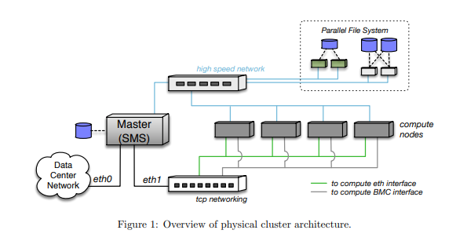

#Overview

##Particular considerations

The cluster follows a typical basic layout. But since it's a simple cluster, the following properties apply:

* Login, cluster management and task submission roles are concentrated in one node.
* There is no dedicated (fast, low-latency) storage network. Service, provision, management and application data transfer are carried over the same regular internal ethernet network. 

##Diagram

To BE DONE: include specific diagram.

